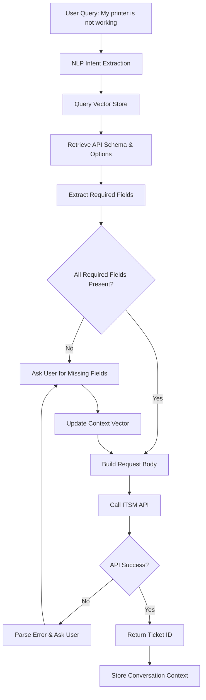

# NLP-Driven API Integration for ITSM Ticket Creation

## System Overview

This solution creates an intelligent conversational interface that extracts user intent from natural language queries and automatically calls appropriate ITSM APIs to create tickets. The system handles complex scenarios with required/optional fields, dynamic option selection, and error handling.

## Architecture Flow



## Vector Database Schema (Qdrant)

```python
# Vector collections structure
collections = {
    "api_schemas": {
        "vector_size": 384,
        "payload": {
            "endpoint": "string",
            "method": "string", 
            "required_fields": ["array"],
            "optional_fields": ["array"],
            "field_options": "dict"
        }
    },
    "conversation_context": {
        "vector_size": 384,
        "payload": {
            "session_id": "string",
            "extracted_entities": "dict",
            "pending_fields": ["array"],
            "api_endpoint": "string"
        }
    }
}
```


## Core Functions

### 1. Intent Extraction \& Entity Recognition

```python
from sentence_transformers import SentenceTransformer
from qdrant_client import QdrantClient
import json

class IntentExtractor:
    def __init__(self):
        self.model = SentenceTransformer('all-MiniLM-L6-v2')
        self.qdrant = QdrantClient(host="localhost", port=6333)
    
    def extract_intent(self, user_query, session_id):
        """Extract intent and entities from user query"""
        query_embedding = self.model.encode(user_query)
        
        # Search for matching API schema
        results = self.qdrant.search(
            collection_name="api_schemas",
            query_vector=query_embedding,
            limit=1
        )
        
        if results:
            api_schema = results[0].payload
            entities = self._extract_entities(user_query, api_schema)
            
            return {
                "intent": "create_ticket",
                "api_endpoint": api_schema["endpoint"],
                "entities": entities,
                "schema": api_schema
            }
        
        return None
    
    def _extract_entities(self, query, schema):
        """Extract entities using simple pattern matching"""
        entities = {}
        
        # Basic entity extraction patterns
        patterns = {
            "issue_type": ["printer", "laptop", "network", "software"],
            "priority": ["urgent", "high", "medium", "low"],
            "description": query  # Full query as description
        }
        
        for field, options in patterns.items():
            if field == "description":
                entities[field] = query
            else:
                for option in options:
                    if option.lower() in query.lower():
                        entities[field] = option
                        break
        
        return entities
```


### 2. Context Management

```python
class ContextManager:
    def __init__(self, qdrant_client):
        self.qdrant = qdrant_client
        self.model = SentenceTransformer('all-MiniLM-L6-v2')
    
    def save_context(self, session_id, entities, pending_fields, api_endpoint):
        """Save conversation context to vector store"""
        context_text = f"Session: {session_id} Entities: {json.dumps(entities)}"
        embedding = self.model.encode(context_text)
        
        self.qdrant.upsert(
            collection_name="conversation_context",
            points=[{
                "id": session_id,
                "vector": embedding,
                "payload": {
                    "session_id": session_id,
                    "extracted_entities": entities,
                    "pending_fields": pending_fields,
                    "api_endpoint": api_endpoint
                }
            }]
        )
    
    def get_context(self, session_id):
        """Retrieve conversation context"""
        results = self.qdrant.scroll(
            collection_name="conversation_context",
            scroll_filter={
                "must": [{"key": "session_id", "match": {"value": session_id}}]
            }
        )
        
        if results[0]:
            return results[0][0].payload
        return None
```


### 3. API Schema Validator

```python
class APIValidator:
    def __init__(self, api_schemas):
        self.schemas = api_schemas
    
    def validate_request(self, entities, schema):
        """Validate if all required fields are present"""
        missing_fields = []
        
        for field in schema["required_fields"]:
            if field not in entities:
                missing_fields.append(field)
        
        return missing_fields
    
    def get_field_options(self, field_name, schema):
        """Get available options for a field"""
        return schema.get("field_options", {}).get(field_name, [])
    
    def build_request_body(self, entities, schema):
        """Build API request body from entities"""
        request_body = {}
        
        # Add required fields
        for field in schema["required_fields"]:
            if field in entities:
                request_body[field] = entities[field]
        
        # Add optional fields if present
        for field in schema["optional_fields"]:
            if field in entities:
                request_body[field] = entities[field]
        
        return request_body
```


### 4. ITSM API Client

```python
import requests

class ITSMClient:
    def __init__(self, base_url, auth_token):
        self.base_url = base_url
        self.headers = {
            "Authorization": f"Bearer {auth_token}",
            "Content-Type": "application/json"
        }
    
    def create_ticket(self, request_body):
        """Create ITSM ticket via API"""
        try:
            response = requests.post(
                f"{self.base_url}/api/tickets",
                json=request_body,
                headers=self.headers
            )
            
            if response.status_code == 201:
                return {"success": True, "data": response.json()}
            else:
                return {
                    "success": False, 
                    "error": response.json().get("message", "Unknown error")
                }
        
        except requests.exceptions.RequestException as e:
            return {"success": False, "error": str(e)}
    
    def get_field_options(self, field_name):
        """Get available options for a field"""
        try:
            response = requests.get(
                f"{self.base_url}/api/fields/{field_name}/options",
                headers=self.headers
            )
            
            if response.status_code == 200:
                return response.json().get("options", [])
            return []
        
        except requests.exceptions.RequestException:
            return []
```


### 5. Conversation Handler

```python
class ConversationHandler:
    def __init__(self):
        self.intent_extractor = IntentExtractor()
        self.context_manager = ContextManager(self.intent_extractor.qdrant)
        self.validator = APIValidator(self._load_api_schemas())
        self.itsm_client = ITSMClient("https://itsm-api.company.com", "your_token")
    
    def handle_query(self, user_query, session_id):
        """Main conversation handler"""
        # Extract intent and entities
        intent_result = self.intent_extractor.extract_intent(user_query, session_id)
        
        if not intent_result:
            return "I couldn't understand your request. Please try again."
        
        # Get or create context
        context = self.context_manager.get_context(session_id) or {}
        
        # Merge entities with existing context
        all_entities = {**context.get("extracted_entities", {}), **intent_result["entities"]}
        
        # Validate required fields
        missing_fields = self.validator.validate_request(all_entities, intent_result["schema"])
        
        if missing_fields:
            return self._ask_for_missing_fields(missing_fields, session_id, all_entities, intent_result)
        
        # All fields present, create ticket
        return self._create_ticket(all_entities, intent_result["schema"], session_id)
    
    def _ask_for_missing_fields(self, missing_fields, session_id, entities, intent_result):
        """Ask user for missing required fields"""
        # Save context
        self.context_manager.save_context(
            session_id, entities, missing_fields, intent_result["api_endpoint"]
        )
        
        field = missing_fields[0]
        options = self.validator.get_field_options(field, intent_result["schema"])
        
        if options:
            options_text = ", ".join(options)
            return f"Please select {field} from: {options_text}"
        else:
            return f"Please provide {field}:"
    
    def _create_ticket(self, entities, schema, session_id):
        """Create ticket and handle response"""
        request_body = self.validator.build_request_body(entities, schema)
        
        # Confirm with user before creating
        return f"Would you like me to create a ticket with these details?\n" \
               f"Issue: {entities.get('description', 'N/A')}\n" \
               f"Type: {entities.get('issue_type', 'N/A')}\n" \
               f"Priority: {entities.get('priority', 'Medium')}\n\n" \
               f"Reply 'yes' to confirm."
    
    def confirm_ticket_creation(self, session_id):
        """Handle ticket creation confirmation"""
        context = self.context_manager.get_context(session_id)
        
        if not context:
            return "Session expired. Please start again."
        
        schema = self._get_schema_by_endpoint(context["api_endpoint"])
        request_body = self.validator.build_request_body(context["extracted_entities"], schema)
        
        result = self.itsm_client.create_ticket(request_body)
        
        if result["success"]:
            ticket_id = result["data"].get("ticket_id")
            return f"✅ Ticket created successfully! Ticket ID: {ticket_id}"
        else:
            return f"❌ Error creating ticket: {result['error']}"
    
    def _load_api_schemas(self):
        """Load API schemas - simplified example"""
        return {
            "create_ticket": {
                "endpoint": "/api/tickets",
                "method": "POST",
                "required_fields": ["description", "issue_type"],
                "optional_fields": ["priority", "assignee"],
                "field_options": {
                    "issue_type": ["hardware", "software", "network", "printer"],
                    "priority": ["low", "medium", "high", "urgent"]
                }
            }
        }
    
    def _get_schema_by_endpoint(self, endpoint):
        """Get schema by endpoint"""
        schemas = self._load_api_schemas()
        for schema in schemas.values():
            if schema["endpoint"] == endpoint:
                return schema
        return None
```


## Implementation Steps

### **Step 1: Setup Vector Database**

- Initialize Qdrant collections
- Load API schemas into vector store
- Create embeddings for schema matching


### **Step 2: Implement Core Functions**

- Intent extraction with entity recognition
- Context management for multi-turn conversations
- API validation and request building


### **Step 3: Integration \& Testing**

- Connect to ITSM API endpoints
- Test conversation flows
- Handle edge cases and errors


### **Step 4: Optimization**

- Implement caching for frequently accessed data
- Optimize vector search parameters
- Add human-in-the-loop confirmation steps


## Example Conversation Flow

**User**: "My printer is not working"

**System**: "I'd like to help you create a ticket. Please select the issue type from: hardware, software, network, printer"

**User**: "printer"

**System**: "Would you like me to create a ticket with these details?

- Issue: My printer is not working
- Type: printer
- Priority: Medium

Reply 'yes' to confirm."

**User**: "yes"

**System**: "✅ Ticket created successfully! Ticket ID: INC-2024-001"

This solution provides a minimal yet comprehensive approach to NLP-driven API integration, optimizing token usage while maintaining functionality through smart context management and vector-based storage.

