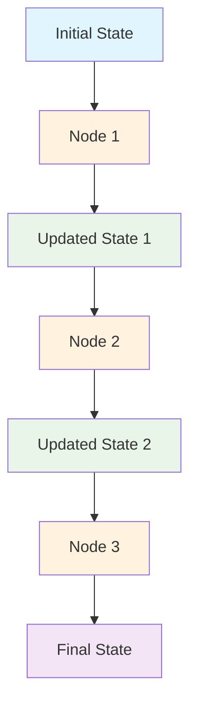
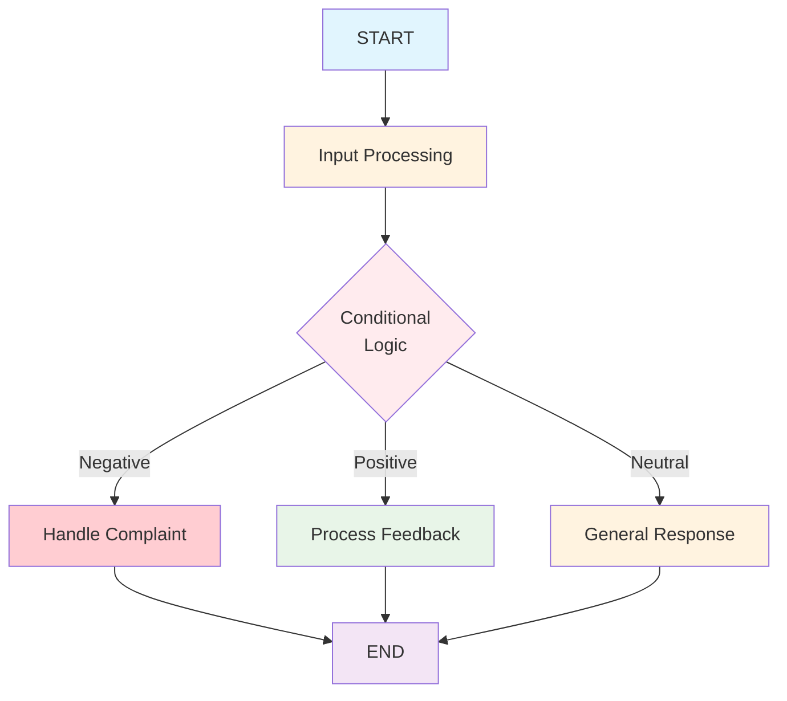
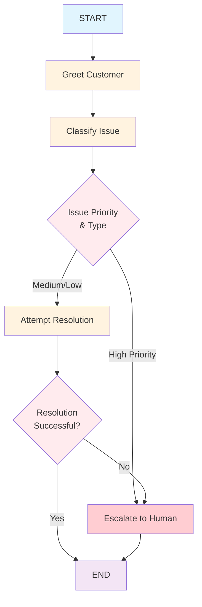
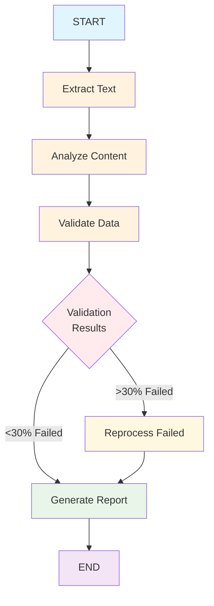
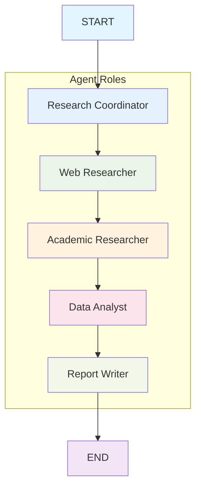
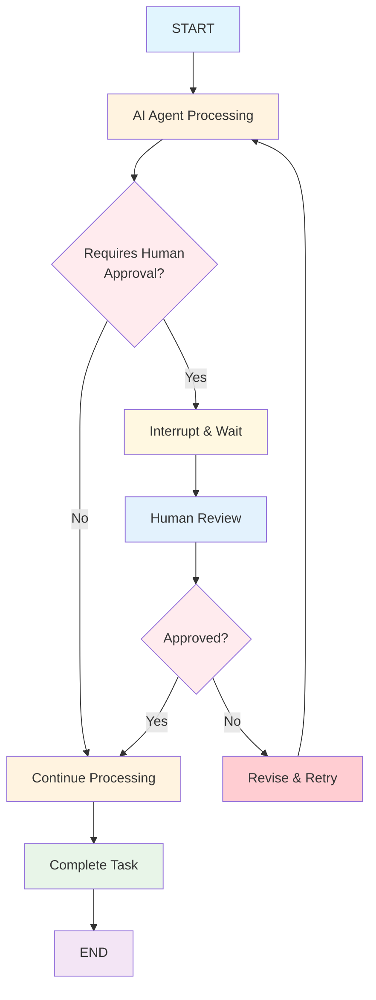
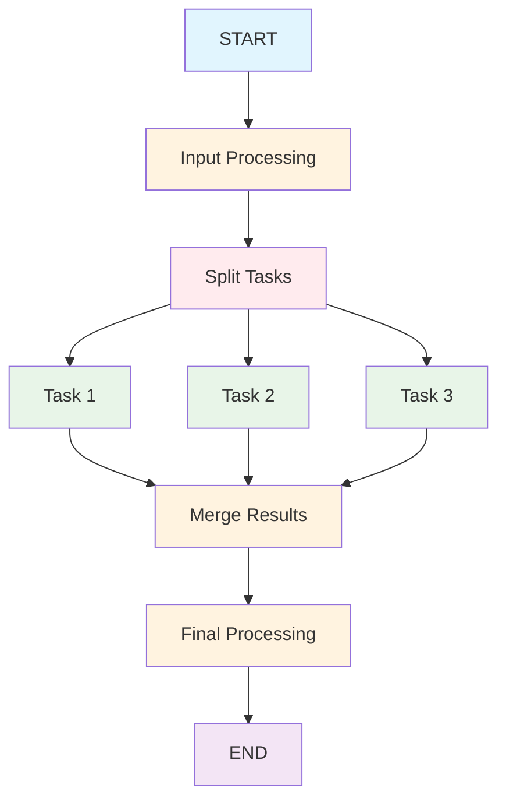

# The Complete Guide to LangGraph: Mastering Nodes, Edges, and Real-World Workflows

LangGraph has emerged as a powerful framework for building stateful, multi-agent AI applications that go far beyond simple chatbots. Unlike traditional linear workflows, LangGraph enables you to create complex, cyclical graphs where AI agents can reason, make decisions, and collaborate in sophisticated ways. This comprehensive guide will teach you everything you need to know about nodes, edges, and building real-world applications with LangGraph.

## Why LangGraph Matters for Modern AI Development

Traditional AI applications often follow linear, predetermined paths that struggle with complex, real-world scenarios. LangGraph addresses this limitation by modeling workflows as graphs where each node represents a specific function or agent, and edges define the flow of information and control between them [^1][^2][^3].

The key advantages of LangGraph include:

- **Stateful workflows** that maintain context across multiple interactions
- **Conditional routing** that adapts based on dynamic conditions
- **Multi-agent coordination** for complex problem-solving
- **Human-in-the-loop integration** for oversight and control
- **Error handling and recovery** mechanisms


## Core Concepts: State, Nodes, and Edges

### Understanding State in LangGraph

State in LangGraph is the shared data structure that represents the current snapshot of your application. It acts as the communication medium between nodes, allowing them to share information and coordinate their actions [^4][^5].



Here's how to define state effectively:

```python
from typing import Annotated, TypedDict, List
from langgraph.graph.message import add_messages
from operator import add

class ApplicationState(TypedDict):
    messages: Annotated[list, add_messages]  # Append messages
    user_data: dict                          # Override completely
    processing_steps: Annotated[List[str], add]  # Accumulate steps
    current_status: str                      # Track current state
    error_count: int                         # Simple integer field
```


### Defining Nodes: The Building Blocks

Nodes are Python functions that perform specific tasks within your workflow. They receive the current state as input and return updates to that state [^4][^5].

#### Basic Node Structure

```python
def my_node(state: ApplicationState) -> dict:
    """Process the current state and return updates"""
    # Your processing logic here
    result = process_data(state["user_data"])
    
    return {
        "processing_steps": ["Data processed"],
        "current_status": "completed",
        "result": result
    }
```


#### Node Types and Patterns

**1. Processing Nodes**

```python
def analyze_text(state: ApplicationState) -> dict:
    """Analyze text content and extract insights"""
    messages = state["messages"]
    last_message = messages[-1] if messages else None
    
    if last_message:
        # Simulate text analysis
        sentiment = "positive" if "good" in last_message.content.lower() else "neutral"
        keywords = extract_keywords(last_message.content)
        
        return {
            "analysis_results": {
                "sentiment": sentiment,
                "keywords": keywords,
                "confidence": 0.85
            },
            "processing_steps": ["Text analysis completed"]
        }
    
    return {"processing_steps": ["No text to analyze"]}
```

**2. Decision Nodes**

```python
def evaluate_risk(state: ApplicationState) -> dict:
    """Evaluate risk based on current data"""
    user_data = state["user_data"]
    
    risk_score = calculate_risk(user_data)
    risk_level = "high" if risk_score > 0.7 else "medium" if risk_score > 0.3 else "low"
    
    return {
        "risk_assessment": {
            "score": risk_score,
            "level": risk_level,
            "recommendation": get_recommendation(risk_level)
        },
        "current_status": f"risk_evaluated_{risk_level}"
    }
```

**3. Integration Nodes**

```python
def fetch_external_data(state: ApplicationState) -> dict:
    """Fetch data from external APIs"""
    user_id = state["user_data"].get("user_id")
    
    try:
        external_data = api_client.get_user_profile(user_id)
        return {
            "external_data": external_data,
            "processing_steps": ["External data fetched successfully"],
            "current_status": "data_enriched"
        }
    except Exception as e:
        return {
            "processing_steps": [f"External data fetch failed: {str(e)}"],
            "current_status": "data_fetch_failed",
            "error_count": state.get("error_count", 0) + 1
        }
```


### Mastering Edges: Controlling Flow

Edges define how your application flows from one node to another. LangGraph supports several types of edges for different scenarios [^4][^5].

#### Normal Edges

Direct connections between nodes for sequential processing:

```python
builder.add_edge("process_input", "analyze_data")
builder.add_edge("analyze_data", "generate_response")
```


#### Conditional Edges

Dynamic routing based on state conditions:

```python
def route_based_on_analysis(state: ApplicationState) -> str:
    """Route based on analysis results"""
    analysis = state.get("analysis_results", {})
    sentiment = analysis.get("sentiment", "neutral")
    
    if sentiment == "negative":
        return "handle_complaint"
    elif sentiment == "positive":
        return "process_feedback"
    else:
        return "general_response"

builder.add_conditional_edges(
    "analyze_text",
    route_based_on_analysis,
    {
        "handle_complaint": "complaint_handler",
        "process_feedback": "feedback_processor",
        "general_response": "general_responder"
    }
)
```




## Real-World Use Case 1: Customer Support Bot

Let's build a comprehensive customer support bot that demonstrates advanced LangGraph patterns:




### State Definition

```python
from typing import Annotated, TypedDict
from langgraph.graph import StateGraph, START, END, add_messages
from langchain_core.messages import HumanMessage, AIMessage

class CustomerSupportState(TypedDict):
    messages: Annotated[list, add_messages]
    customer_id: str
    issue_type: str
    priority: str
    resolved: bool
    escalation_reason: str
```


### Node Implementation

```python
def greet_customer(state: CustomerSupportState):
    """Initial greeting and customer identification"""
    last_message = state["messages"][-1]
    
    # Extract customer ID (simplified for demo)
    customer_id = extract_customer_id(last_message.content)
    
    response = AIMessage(
        content=f"Hello! I'm here to help you today. I see you're customer {customer_id}. How can I assist you?"
    )
    
    return {
        "messages": [response],
        "customer_id": customer_id,
        "priority": "medium"
    }

def classify_issue(state: CustomerSupportState):
    """Classify customer issue and set priority"""
    last_message = state["messages"][-1]
    content = last_message.content.lower()
    
    # Classification logic
    if any(word in content for word in ["urgent", "broken", "not working"]):
        issue_type = "technical"
        priority = "high"
    elif any(word in content for word in ["bill", "charge", "payment"]):
        issue_type = "billing"
        priority = "high"
    elif any(word in content for word in ["cancel", "refund"]):
        issue_type = "cancellation"
        priority = "medium"
    else:
        issue_type = "general"
        priority = "low"
    
    response = AIMessage(
        content=f"I understand this is a {issue_type} issue. Let me help you with that."
    )
    
    return {
        "messages": [response],
        "issue_type": issue_type,
        "priority": priority
    }

def resolve_issue(state: CustomerSupportState):
    """Attempt to resolve the customer's issue"""
    issue_type = state["issue_type"]
    
    solutions = {
        "technical": "Let me walk you through the troubleshooting steps...",
        "billing": "I've reviewed your account and can process a refund...",
        "cancellation": "I can help you with the cancellation process...",
        "general": "I'll be happy to help with your inquiry..."
    }
    
    response = AIMessage(content=solutions.get(issue_type, "Let me find the best solution."))
    
    # Simulate resolution success/failure
    success_rate = {"technical": 0.7, "billing": 0.9, "cancellation": 0.8, "general": 0.95}
    resolved = random.random() < success_rate.get(issue_type, 0.8)
    
    return {
        "messages": [response],
        "resolved": resolved
    }

def escalate_to_human(state: CustomerSupportState):
    """Escalate to human agent"""
    escalation_reason = state.get("escalation_reason", "Complex issue requiring human attention")
    
    response = AIMessage(
        content=f"I'm escalating your issue to a specialist. Reason: {escalation_reason}. Please hold."
    )
    
    return {
        "messages": [response],
        "resolved": True  # Escalation counts as resolution
    }
```


### Routing Logic

```python
def should_escalate(state: CustomerSupportState) -> str:
    """Determine if issue should be escalated"""
    priority = state["priority"]
    resolved = state.get("resolved", False)
    
    if priority == "high" and not resolved:
        return "escalate"
    elif resolved:
        return "end"
    else:
        return "resolve"

def post_resolution_routing(state: CustomerSupportState) -> str:
    """Route after resolution attempt"""
    resolved = state.get("resolved", False)
    
    if resolved:
        return "end"
    else:
        return "escalate"
```


### Building the Graph

```python
def build_customer_support_bot():
    builder = StateGraph(CustomerSupportState)
    
    # Add nodes
    builder.add_node("greet", greet_customer)
    builder.add_node("classify", classify_issue)
    builder.add_node("resolve", resolve_issue)
    builder.add_node("escalate", escalate_to_human)
    
    # Add edges
    builder.add_edge(START, "greet")
    builder.add_edge("greet", "classify")
    
    builder.add_conditional_edges(
        "classify",
        should_escalate,
        {
            "resolve": "resolve",
            "escalate": "escalate",
            "end": END
        }
    )
    
    builder.add_conditional_edges(
        "resolve",
        post_resolution_routing,
        {
            "escalate": "escalate",
            "end": END
        }
    )
    
    builder.add_edge("escalate", END)
    
    return builder.compile()
```


## Real-World Use Case 2: Document Processing Pipeline

Document processing showcases LangGraph's ability to handle complex, multi-step workflows with error handling and quality control:




### State Definition

```python
from typing import List, Dict
from operator import add

class DocumentProcessingState(TypedDict):
    documents: List[str]
    processed_documents: Annotated[List[dict], add]
    extracted_data: Annotated[List[dict], add]
    validation_results: Annotated[List[dict], add]
    failed_documents: List[str]
    final_report: str
    processing_stats: dict
```


### Processing Nodes

```python
def extract_text_node(state: DocumentProcessingState):
    """Extract text from documents"""
    documents = state["documents"]
    processed_docs = []
    
    for i, doc in enumerate(documents):
        try:
            # Simulate text extraction
            extracted_text = extract_text_from_document(doc)
            processed_docs.append({
                "document_id": i+1,
                "original_name": doc,
                "extracted_text": extracted_text,
                "word_count": len(extracted_text.split()),
                "extraction_confidence": 0.95
            })
        except Exception as e:
            processed_docs.append({
                "document_id": i+1,
                "original_name": doc,
                "error": str(e),
                "extraction_confidence": 0.0
            })
    
    return {"processed_documents": processed_docs}

def analyze_content_node(state: DocumentProcessingState):
    """Analyze content and extract structured data"""
    processed_docs = state["processed_documents"]
    extracted_data = []
    
    for doc in processed_docs:
        if doc.get("error"):
            continue
            
        # Simulate content analysis
        analysis = {
            "document_id": doc["document_id"],
            "sentiment": analyze_sentiment(doc["extracted_text"]),
            "key_topics": extract_topics(doc["extracted_text"]),
            "entities": extract_entities(doc["extracted_text"]),
            "confidence_score": calculate_confidence(doc["extracted_text"])
        }
        extracted_data.append(analysis)
    
    return {"extracted_data": extracted_data}

def validate_data_node(state: DocumentProcessingState):
    """Validate extracted data for quality"""
    extracted_data = state["extracted_data"]
    validation_results = []
    
    for data in extracted_data:
        validation = {
            "document_id": data["document_id"],
            "validation_passed": data["confidence_score"] > 0.8,
            "issues": get_validation_issues(data),
            "quality_score": data["confidence_score"]
        }
        validation_results.append(validation)
    
    return {"validation_results": validation_results}
```


### Conditional Processing

```python
def should_reprocess(state: DocumentProcessingState) -> str:
    """Determine if reprocessing is needed"""
    validation_results = state["validation_results"]
    
    if not validation_results:
        return "generate_report"
    
    failed_count = sum(1 for v in validation_results if not v["validation_passed"])
    failure_rate = failed_count / len(validation_results)
    
    if failure_rate > 0.3:  # More than 30% failed
        return "reprocess"
    else:
        return "generate_report"

def reprocess_failed_node(state: DocumentProcessingState):
    """Reprocess failed documents with enhanced parameters"""
    validation_results = state["validation_results"]
    failed_docs = [v["document_id"] for v in validation_results if not v["validation_passed"]]
    
    # Simulate reprocessing with better parameters
    updated_validations = []
    for validation in validation_results:
        if validation["document_id"] in failed_docs:
            # Improve validation results through reprocessing
            validation["validation_passed"] = True
            validation["quality_score"] = min(validation["quality_score"] + 0.2, 1.0)
            validation["issues"] = []
        updated_validations.append(validation)
    
    return {
        "validation_results": updated_validations,
        "failed_documents": failed_docs
    }
```


## Real-World Use Case 3: Multi-Agent Research System

This example demonstrates how multiple specialized agents can collaborate on complex research tasks:




### Multi-Agent State

```python
class ResearchState(TypedDict):
    messages: Annotated[list, add_messages]
    research_query: str
    research_plan: dict
    web_sources: Annotated[List[dict], add]
    academic_sources: Annotated[List[dict], add]
    analysis_results: Annotated[List[dict], add]
    final_report: str
    current_agent: str
    agent_handoffs: Annotated[List[dict], add]
```


### Agent Implementation

```python
def research_coordinator(state: ResearchState):
    """Plan and coordinate the research process"""
    query = state["research_query"]
    
    research_plan = {
        "query": query,
        "methodology": "Multi-agent collaborative research",
        "agents": ["web_researcher", "academic_researcher", "data_analyst", "report_writer"],
        "timeline": "Estimated 30 minutes",
        "success_criteria": "Comprehensive report with multiple source types"
    }
    
    handoff = {
        "from_agent": "coordinator",
        "to_agent": "web_researcher",
        "context": f"Research query: {query}",
        "timestamp": "2024-01-01T10:00:00Z"
    }
    
    return {
        "messages": [AIMessage(content=f"Research plan created for: {query}")],
        "research_plan": research_plan,
        "current_agent": "web_researcher",
        "agent_handoffs": [handoff]
    }

def web_researcher(state: ResearchState):
    """Conduct web research"""
    query = state["research_query"]
    
    web_sources = conduct_web_search(query)
    
    handoff = {
        "from_agent": "web_researcher",
        "to_agent": "academic_researcher",
        "context": f"Found {len(web_sources)} web sources",
        "timestamp": "2024-01-01T10:10:00Z"
    }
    
    return {
        "messages": [AIMessage(content=f"Web research completed: {len(web_sources)} sources found")],
        "web_sources": web_sources,
        "current_agent": "academic_researcher",
        "agent_handoffs": [handoff]
    }

def academic_researcher(state: ResearchState):
    """Conduct academic research"""
    query = state["research_query"]
    
    academic_sources = conduct_academic_search(query)
    
    handoff = {
        "from_agent": "academic_researcher",
        "to_agent": "data_analyst",
        "context": f"Found {len(academic_sources)} academic sources",
        "timestamp": "2024-01-01T10:20:00Z"
    }
    
    return {
        "messages": [AIMessage(content=f"Academic research completed: {len(academic_sources)} sources found")],
        "academic_sources": academic_sources,
        "current_agent": "data_analyst",
        "agent_handoffs": [handoff]
    }
```


### Agent Routing

```python
def route_to_next_agent(state: ResearchState) -> str:
    """Route to the next agent in the research pipeline"""
    current_agent = state.get("current_agent", "coordinator")
    
    agent_flow = {
        "coordinator": "web_researcher",
        "web_researcher": "academic_researcher",
        "academic_researcher": "data_analyst",
        "data_analyst": "report_writer",
        "report_writer": "end"
    }
    
    return agent_flow.get(current_agent, "end")
```


## Advanced Patterns and Best Practices

### Human-in-the-Loop Integration




### Implementing Human-in-the-Loop

```python
from langgraph.types import interrupt

def process_with_approval(state: ApplicationState):
    """Process with human approval checkpoint"""
    sensitive_action = state.get("pending_action")
    
    if requires_human_approval(sensitive_action):
        # Interrupt execution and wait for human input
        human_decision = interrupt({
            "action": sensitive_action,
            "context": state.get("context", {}),
            "recommendation": "Approve",
            "risk_level": "Medium"
        })
        
        if human_decision.get("approved"):
            return execute_action(sensitive_action)
        else:
            return {
                "status": "rejected",
                "reason": human_decision.get("reason", "Human rejected")
            }
    
    return execute_action(sensitive_action)
```


### Parallel Processing Pattern




### Error Handling and Recovery

```python
def robust_processing_node(state: ApplicationState):
    """Node with comprehensive error handling"""
    try:
        result = perform_complex_operation(state)
        return {
            "result": result,
            "status": "success",
            "processing_steps": ["Operation completed successfully"]
        }
    except RetryableError as e:
        retry_count = state.get("retry_count", 0)
        if retry_count < 3:
            return {
                "status": "retry",
                "retry_count": retry_count + 1,
                "error_message": str(e)
            }
        else:
            return {
                "status": "failed",
                "error_message": f"Max retries exceeded: {str(e)}"
            }
    except CriticalError as e:
        return {
            "status": "critical_failure",
            "error_message": str(e),
            "requires_intervention": True
        }
```


## Performance Optimization and Monitoring

### State Management Best Practices

1. **Use Appropriate Reducers**
```python
# For accumulating data
processing_log: Annotated[List[str], add]

# For maintaining latest value
current_status: str

# For message handling
messages: Annotated[list, add_messages]
```

2. **Implement Caching**
```python
from langgraph.cache.memory import InMemoryCache
from langgraph.types import CachePolicy

def expensive_computation(state: ApplicationState):
    # Expensive operation
    return {"result": complex_calculation(state["data"])}

builder.add_node(
    "expensive_node", 
    expensive_computation,
    cache_policy=CachePolicy(ttl=300)  # 5 minutes
)

graph = builder.compile(cache=InMemoryCache())
```

3. **Monitor Performance**
```python
import time
from typing import Dict, Any

def monitoring_wrapper(func):
    def wrapper(state: Dict[str, Any]) -> Dict[str, Any]:
        start_time = time.time()
        result = func(state)
        execution_time = time.time() - start_time
        
        # Add monitoring data
        result["execution_metrics"] = {
            "node_name": func.__name__,
            "execution_time": execution_time,
            "timestamp": time.time()
        }
        
        return result
    return wrapper
```


## Common Pitfalls and Solutions

### 1. State Mutation Issues

**Problem**: Accidentally mutating state instead of returning updates
**Solution**: Always return new objects

```python
# ❌ Wrong - mutates state
def bad_node(state: ApplicationState):
    state["data"].append("new_item")
    return state

# ✅ Correct - returns updates
def good_node(state: ApplicationState):
    return {"data": state["data"] + ["new_item"]}
```


### 2. Infinite Loops

**Problem**: Conditional edges creating cycles without termination
**Solution**: Include termination conditions and recursion limits

```python
def safe_routing(state: ApplicationState) -> str:
    iteration_count = state.get("iteration_count", 0)
    
    if iteration_count > 10:
        return "end"  # Force termination
    
    # Normal routing logic
    if needs_processing(state):
        return "process"
    else:
        return "end"
```


### 3. Error Propagation

**Problem**: Errors in one node breaking the entire workflow
**Solution**: Implement error boundaries

```python
def error_boundary_node(state: ApplicationState):
    try:
        return risky_operation(state)
    except Exception as e:
        return {
            "error": str(e),
            "status": "error",
            "fallback_used": True
        }
```


## Conclusion

LangGraph represents a paradigm shift in AI application development, enabling the creation of sophisticated, stateful workflows that can handle complex real-world scenarios. By mastering nodes, edges, and state management, you can build applications that are:

- **Resilient** through error handling and recovery mechanisms
- **Scalable** via modular design and parallel processing
- **Maintainable** with clear separation of concerns
- **Adaptable** through conditional routing and dynamic behavior

The examples in this guide demonstrate practical patterns you can adapt for your specific use cases. Whether you're building customer support systems, document processing pipelines, or multi-agent research tools, LangGraph provides the flexibility and power to create truly intelligent applications.

Start with simple workflows and gradually add complexity as you become more comfortable with the framework. Remember that the key to successful LangGraph applications lies in thoughtful state design, robust error handling, and clear separation of responsibilities between nodes.


[^1]: https://datasciencedojo.com/blog/langgraph-tutorial/

[^2]: https://blog.langchain.dev/langgraph/

[^3]: https://realpython.com/langgraph-python/

[^4]: https://langchain-ai.github.io/langgraph/concepts/low_level/

[^5]: https://langchain-ai.github.io/langgraph/concepts/

[^6]: https://www.ijraset.com/best-journal/personalized-e-learning-assistant-using-knowledge-graph-and-langgraph-orchestrated-multiagent-framework

[^7]: https://pubs.acs.org/doi/10.1021/acsmeasuresciau.2c00070

[^8]: https://ieeexplore.ieee.org/document/10753482/

[^9]: https://arxiv.org/abs/2411.18241

[^10]: https://ieeexplore.ieee.org/document/10737601/

[^11]: https://arxiv.org/abs/2412.03801

[^12]: https://ieeexplore.ieee.org/document/9326394/

[^13]: http://ieeexplore.ieee.org/document/8114708/

[^14]: http://link.springer.com/10.3758/s13428-017-0862-1

[^15]: https://ieeexplore.ieee.org/document/10038476/

[^16]: http://arxiv.org/pdf/2305.10037.pdf

[^17]: https://arxiv.org/pdf/2310.13023.pdf

[^18]: https://langchain-ai.github.io/langgraph/

[^19]: https://www.datacamp.com/tutorial/langgraph-tutorial

[^20]: https://python.langchain.com/api_reference/core/runnables/langchain_core.runnables.graph.Graph.html

[^21]: https://github.com/langchain-ai/langgraph-example

[^22]: https://blog.langchain.com/langgraph-multi-agent-workflows/

[^23]: https://www.langchain.com/langgraph

[^24]: https://www.gettingstarted.ai/langgraph-tutorial-with-example/

[^25]: https://www.youtube.com/watch?v=hvAPnpSfSGo

[^26]: https://pubs.acs.org/doi/10.1021/acs.nanolett.3c00829

[^27]: https://www.arcjournals.org/pdfs/ajcs/v6-i2/2.pdf

[^28]: https://vjs.ac.vn/index.php/jse/article/view/14233

[^29]: https://bmccancer.biomedcentral.com/articles/10.1186/s12885-019-6065-7

[^30]: https://onlinelibrary.wiley.com/doi/10.1002/ags3.12652

[^31]: https://www.spandidos-publications.com/10.3892/mco.2016.911

[^32]: http://ieeexplore.ieee.org/document/7444316/

[^33]: https://onlinelibrary.wiley.com/doi/10.1002/ajh.26292

[^34]: https://www.mdpi.com/1424-8220/18/7/2104

[^35]: http://arxiv.org/pdf/2402.08170.pdf

[^36]: https://arxiv.org/pdf/2402.16823.pdf

[^37]: https://arxiv.org/pdf/2412.03801.pdf

[^38]: https://dev.to/jamesli/advanced-langgraph-implementing-conditional-edges-and-tool-calling-agents-3pdn

[^39]: https://www.linkedin.com/pulse/exploring-langgraph-powerful-library-state-management-ai-workflows-v4vtf

[^40]: https://www.youtube.com/watch?v=qRxsCunfhws

[^41]: https://stackoverflow.com/questions/79654297/conditional-edge-in-langgraph-is-not-working-as-expected

[^42]: https://dev.to/jamesli/langgraph-state-machines-managing-complex-agent-task-flows-in-production-36f4

[^43]: https://www.js-craft.io/blog/langgraph-js-conditional-edges-graphs/

[^44]: https://www.youtube.com/watch?v=EKxoCVbXZwY

[^45]: https://www.youtube.com/watch?v=DBXdE_5Jces

[^46]: https://towardsdatascience.com/from-basics-to-advanced-exploring-langgraph-e8c1cf4db787/

[^47]: https://github.com/langchain-ai/langgraph/discussions/2498

[^48]: https://langchain-ai.github.io/langgraph/tutorials/get-started/5-customize-state/

[^49]: https://dl.acm.org/doi/10.1145/3649217.3653562

[^50]: https://dl.acm.org/doi/10.1145/3545945.3569843

[^51]: https://dl.acm.org/doi/10.1145/3568813.3600141

[^52]: https://arxiv.org/abs/2403.05538

[^53]: https://ieeexplore.ieee.org/document/9079197/

[^54]: https://dl.acm.org/doi/10.1145/3524610.3527875

[^55]: https://dl.acm.org/doi/10.1145/3430665.3456370

[^56]: https://dl.acm.org/doi/10.1145/3441636.3442317

[^57]: https://www.semanticscholar.org/paper/77c2ee3d3d5da97a269c15ba031ae9b97ab9d40e

[^58]: https://dl.acm.org/doi/10.1145/3373165.3373182

[^59]: https://arxiv.org/html/2412.01490

[^60]: https://arxiv.org/pdf/2502.18465.pdf

[^61]: https://www.projectpro.io/article/langgraph/1109

[^62]: https://www.projectpro.io/article/langgraph-projects-and-examples/1124

[^63]: https://github.com/langchain-ai/langgraph-swarm-py

[^64]: https://langchain-ai.github.io/langgraphjs/tutorials/

[^65]: https://github.com/von-development/awesome-LangGraph

[^66]: https://www.youtube.com/watch?v=gqvFmK7LpDo

[^67]: https://www.scalablepath.com/machine-learning/langgraph

[^68]: https://langchain-ai.github.io/langgraph/agents/multi-agent/

[^69]: https://www.youtube.com/watch?v=jGg_1h0qzaM

[^70]: https://www.ibm.com/think/topics/langgraph

[^71]: https://aws.amazon.com/blogs/machine-learning/build-a-multi-agent-system-with-langgraph-and-mistral-on-aws/

[^72]: https://www.reddit.com/r/LangChain/comments/1fcefrh/are_there_any_companies_using_langgraph_in/

[^73]: https://discourse.elpub.ru/jour/article/view/630

[^74]: https://linkinghub.elsevier.com/retrieve/pii/S004016252300611X

[^75]: https://aseestant.ceon.rs/index.php/jouproman/article/view/38635

[^76]: https://dl.acm.org/doi/10.1145/3477495.3536331

[^77]: https://link.springer.com/10.1007/978-3-031-06394-7_53

[^78]: https://iopscience.iop.org/article/10.1088/1755-1315/720/1/012093

[^79]: https://www.semanticscholar.org/paper/61be3b9bd505cc58c05d3ec0045a1bf7b07123f0

[^80]: https://www.semanticscholar.org/paper/e29ccfd58ad1771355a13b1f5562883d4fd93f1f

[^81]: https://ieeexplore.ieee.org/document/8404430/

[^82]: https://jogh.org/2023/jogh-13-01003

[^83]: https://www.aclweb.org/anthology/E17-3022.pdf

[^84]: https://arxiv.org/pdf/2206.04659.pdf

[^85]: https://statusneo.com/building-a-powerful-chatbot-with-langgraph/

[^86]: https://www.langchain.com/agents

[^87]: https://www.youtube.com/watch?v=IhW4rgaZ-Hc

[^88]: https://langchain-ai.github.io/langgraph/how-tos/graph-api/

[^89]: https://langchain-ai.github.io/langgraph/tutorials/get-started/1-build-basic-chatbot/

[^90]: https://langchain-ai.github.io/langgraph/tutorials/customer-support/customer-support/

[^91]: https://github.com/pavanbelagatti/LangGraph-Chatbot-Tutorial

[^92]: https://www.linkedin.com/posts/langchain_build-a-customer-support-bot-in-langgraph-activity-7193640755632967681-Xm_P

[^93]: https://dev.to/pavanbelagatti/learn-how-to-build-ai-agents-chatbots-with-langgraph-20o6

[^94]: https://langchain-ai.github.io/langgraphjs/tutorials/workflows/

[^95]: https://github.com/langchain-ai/langgraph/discussions/477

[^96]: https://python.langchain.com/docs/integrations/document_loaders/

[^97]: https://arxiv.org/pdf/2501.11478v2.pdf

[^98]: http://arxiv.org/pdf/2402.08785.pdf

[^99]: https://www.aclweb.org/anthology/2021.maiworkshop-1.12.pdf

[^100]: http://arxiv.org/pdf/2405.20684.pdf

[^101]: https://arxiv.org/pdf/2404.19234.pdf

[^102]: https://dl.acm.org/doi/pdf/10.1145/3637528.3671456

[^103]: https://github.com/langchain-ai/langgraph

[^104]: https://blog.futuresmart.ai/langgraph-tutorial-for-beginners

[^105]: https://langchain-ai.github.io/langgraph/tutorials/workflows/

[^106]: http://arxiv.org/pdf/2502.07982.pdf

[^107]: http://arxiv.org/pdf/2410.12096.pdf

[^108]: http://arxiv.org/pdf/2310.09872.pdf

[^109]: https://arxiv.org/html/2501.00309v1

[^110]: https://blog.gopenai.com/building-stateful-applications-with-langgraph-860de3c9fa90

[^111]: http://arxiv.org/pdf/2304.09048v1.pdf

[^112]: https://arxiv.org/html/2502.14563

[^113]: http://arxiv.org/pdf/2407.19994.pdf

[^114]: http://arxiv.org/pdf/2410.18032.pdf

[^115]: http://arxiv.org/pdf/2409.04183.pdf

[^116]: https://www.youtube.com/watch?v=4oC1ZKa9-Hs

[^117]: http://arxiv.org/pdf/2309.16804.pdf

[^118]: https://arxiv.org/pdf/2111.00570.pdf

[^119]: https://arxiv.org/pdf/2301.05843.pdf

[^120]: http://arxiv.org/pdf/2401.07216.pdf

[^121]: http://arxiv.org/pdf/2501.05541.pdf

[^122]: http://arxiv.org/pdf/2407.18498.pdf

[^123]: https://arxiv.org/pdf/2305.04533.pdf

[^124]: https://www.youtube.com/watch?v=b3XsvoFWp4c

[^125]: https://github.com/RasaHQ/calm-langgraph-customer-service-comparison

[^126]: https://github.com/xbeat/Machine-Learning/blob/main/Basics of LangChain's LangGraph.md

