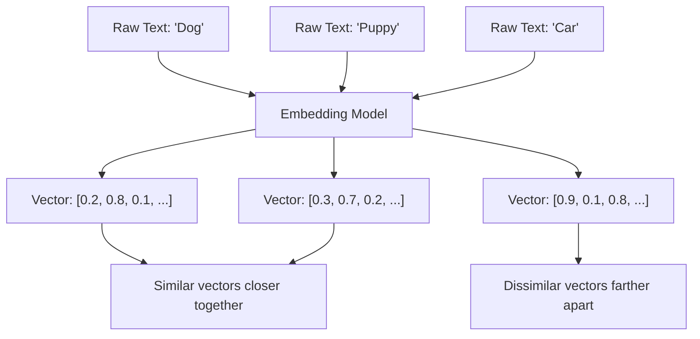
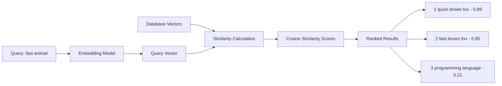

# Vector Database \& Embeddings: Complete Guide with Qdrant

## What are Embeddings?

Embeddings are **dense numerical representations** of data (text, images, audio) that capture semantic meaning in a high-dimensional space. Think of them as coordinates in a multi-dimensional space where similar items are positioned closer together.




### Why Vector Databases?

Traditional databases store exact matches, while vector databases enable **semantic search** - finding items based on meaning rather than exact keywords.

## Getting Started with Qdrant

### Installation and Setup

```bash
# Install Qdrant Python client
pip install qdrant-client sentence-transformers numpy

# Run Qdrant server with Docker
docker run -p 6333:6333 qdrant/qdrant
```


### Basic Qdrant Setup

```python
from qdrant_client import QdrantClient
from qdrant_client.models import Distance, VectorParams, PointStruct
from sentence_transformers import SentenceTransformer
import numpy as np
import uuid

# Initialize Qdrant client
client = QdrantClient(host="localhost", port=6333)

# Initialize embedding model
encoder = SentenceTransformer('all-MiniLM-L6-v2')

# Create collection
collection_name = "documents"
client.create_collection(
    collection_name=collection_name,
    vectors_config=VectorParams(size=384, distance=Distance.COSINE)
)
```


## Understanding Embeddings in Detail

### How Embeddings Are Created

```python
def create_embeddings(texts):
    """Create embeddings from text data"""
    # Generate embeddings
    embeddings = encoder.encode(texts)
    
    # Normalize embeddings (optional but recommended)
    embeddings = embeddings / np.linalg.norm(embeddings, axis=1, keepdims=True)
    
    return embeddings

# Example usage
sample_texts = [
    "The quick brown fox jumps over the lazy dog",
    "A fast brown fox leaps over a sleepy dog",
    "Python is a programming language",
    "Machine learning uses neural networks"
]

embeddings = create_embeddings(sample_texts)
print(f"Embedding shape: {embeddings.shape}")
print(f"First embedding: {embeddings[0][:5]}...")  # Show first 5 dimensions
```


### Embedding Similarity Visualization




## Core Vector Database Operations

### 1. Inserting Data with Embeddings

```python
def insert_documents(documents, collection_name):
    """Insert documents with their embeddings"""
    
    # Create embeddings
    embeddings = create_embeddings(documents)
    
    # Prepare points for insertion
    points = []
    for i, (doc, embedding) in enumerate(zip(documents, embeddings)):
        point = PointStruct(
            id=str(uuid.uuid4()),
            vector=embedding.tolist(),
            payload={"text": doc, "index": i}
        )
        points.append(point)
    
    # Insert into Qdrant
    client.upsert(
        collection_name=collection_name,
        points=points
    )
    
    print(f"Inserted {len(documents)} documents")
    return points

# Insert sample documents
documents = [
    "Python is a versatile programming language",
    "Machine learning enables pattern recognition",
    "Neural networks mimic brain functions",
    "Data science involves statistical analysis",
    "Artificial intelligence automates decision making",
    "Deep learning uses multiple neural layers",
    "Natural language processing understands human language",
    "Computer vision analyzes visual data"
]

inserted_points = insert_documents(documents, collection_name)
```


### 2. Semantic Search and Matching

```python
def semantic_search(query, collection_name, top_k=3):
    """Perform semantic search"""
    
    # Create query embedding
    query_embedding = encoder.encode([query])
    query_embedding = query_embedding / np.linalg.norm(query_embedding)
    
    # Search in Qdrant
    results = client.search(
        collection_name=collection_name,
        query_vector=query_embedding[0].tolist(),
        limit=top_k,
        score_threshold=0.3  # Minimum similarity threshold
    )
    
    return results

# Example searches
queries = [
    "learning algorithms",
    "brain-like computing",
    "text understanding",
    "visual recognition"
]

for query in queries:
    print(f"\nQuery: '{query}'")
    results = semantic_search(query, collection_name)
    
    for result in results:
        print(f"  Score: {result.score:.3f} - {result.payload['text']}")
```


### 3. Advanced Filtering and Hybrid Search

```python
def hybrid_search(query, collection_name, filters=None, top_k=3):
    """Perform hybrid search with filters"""
    
    query_embedding = encoder.encode([query])
    query_embedding = query_embedding / np.linalg.norm(query_embedding)
    
    # Build filter conditions
    filter_conditions = None
    if filters:
        from qdrant_client.models import Filter, FieldCondition, MatchValue
        
        conditions = []
        for key, value in filters.items():
            conditions.append(
                FieldCondition(key=key, match=MatchValue(value=value))
            )
        
        filter_conditions = Filter(must=conditions)
    
    # Search with filters
    results = client.search(
        collection_name=collection_name,
        query_vector=query_embedding[0].tolist(),
        query_filter=filter_conditions,
        limit=top_k
    )
    
    return results

# Example with metadata filtering
# First, let's add some metadata to our documents
def insert_documents_with_metadata(documents, metadata, collection_name):
    """Insert documents with metadata"""
    
    embeddings = create_embeddings(documents)
    
    points = []
    for i, (doc, embedding, meta) in enumerate(zip(documents, embeddings, metadata)):
        point = PointStruct(
            id=str(uuid.uuid4()),
            vector=embedding.tolist(),
            payload={"text": doc, "category": meta["category"], "difficulty": meta["difficulty"]}
        )
        points.append(point)
    
    client.upsert(collection_name=collection_name, points=points)
    return points

# Add metadata to documents
document_metadata = [
    {"category": "programming", "difficulty": "beginner"},
    {"category": "ai", "difficulty": "intermediate"},
    {"category": "ai", "difficulty": "advanced"},
    {"category": "data", "difficulty": "intermediate"},
    {"category": "ai", "difficulty": "advanced"},
    {"category": "ai", "difficulty": "advanced"},
    {"category": "ai", "difficulty": "intermediate"},
    {"category": "ai", "difficulty": "intermediate"}
]

# Create new collection with metadata
collection_name_meta = "documents_with_metadata"
client.create_collection(
    collection_name=collection_name_meta,
    vectors_config=VectorParams(size=384, distance=Distance.COSINE)
)

insert_documents_with_metadata(documents, document_metadata, collection_name_meta)

# Search with filters
results = hybrid_search(
    "machine learning", 
    collection_name_meta, 
    filters={"category": "ai", "difficulty": "intermediate"}
)

print("\nFiltered search results:")
for result in results:
    print(f"Score: {result.score:.3f} - {result.payload['text']}")
    print(f"Category: {result.payload['category']}, Difficulty: {result.payload['difficulty']}")
```


## Optimization Techniques

### 1. Smart Embedding Caching

```python
import hashlib
import pickle
from typing import Dict, List

class EmbeddingCache:
    """Cache for storing computed embeddings"""
    
    def __init__(self, cache_file="embeddings_cache.pkl"):
        self.cache_file = cache_file
        self.cache = self._load_cache()
    
    def _load_cache(self) -> Dict:
        """Load cache from file"""
        try:
            with open(self.cache_file, 'rb') as f:
                return pickle.load(f)
        except FileNotFoundError:
            return {}
    
    def _save_cache(self):
        """Save cache to file"""
        with open(self.cache_file, 'wb') as f:
            pickle.dump(self.cache, f)
    
    def get_embedding(self, text: str) -> np.ndarray:
        """Get embedding from cache or compute new one"""
        text_hash = hashlib.md5(text.encode()).hexdigest()
        
        if text_hash in self.cache:
            return self.cache[text_hash]
        
        # Compute new embedding
        embedding = encoder.encode([text])[0]
        embedding = embedding / np.linalg.norm(embedding)
        
        # Cache the result
        self.cache[text_hash] = embedding
        self._save_cache()
        
        return embedding

# Initialize cache
embedding_cache = EmbeddingCache()

def cached_search(query, collection_name, top_k=3):
    """Search using cached embeddings"""
    
    # Get cached embedding
    query_embedding = embedding_cache.get_embedding(query)
    
    results = client.search(
        collection_name=collection_name,
        query_vector=query_embedding.tolist(),
        limit=top_k
    )
    
    return results
```


### 2. Batch Processing for Efficiency

```python
def batch_insert_documents(documents, collection_name, batch_size=100):
    """Insert documents in batches for better performance"""
    
    for i in range(0, len(documents), batch_size):
        batch = documents[i:i + batch_size]
        
        # Create embeddings for batch
        embeddings = create_embeddings(batch)
        
        # Prepare points
        points = []
        for j, (doc, embedding) in enumerate(zip(batch, embeddings)):
            point = PointStruct(
                id=str(uuid.uuid4()),
                vector=embedding.tolist(),
                payload={"text": doc, "batch_index": i + j}
            )
            points.append(point)
        
        # Insert batch
        client.upsert(collection_name=collection_name, points=points)
        print(f"Inserted batch {i//batch_size + 1}: {len(batch)} documents")

# Example: Insert 1000 documents in batches
large_document_set = [f"Document {i} about various topics" for i in range(1000)]
batch_insert_documents(large_document_set, collection_name)
```


### 3. Embedding Quantization for Storage Efficiency

```python
def quantize_embeddings(embeddings, num_bits=8):
    """Quantize embeddings to reduce storage"""
    
    # Find min/max values
    min_val = np.min(embeddings)
    max_val = np.max(embeddings)
    
    # Quantize
    scale = (max_val - min_val) / (2**num_bits - 1)
    quantized = np.round((embeddings - min_val) / scale).astype(np.uint8)
    
    return quantized, min_val, scale

def dequantize_embeddings(quantized, min_val, scale):
    """Dequantize embeddings"""
    return quantized.astype(np.float32) * scale + min_val

# Example usage
original_embeddings = create_embeddings(["Sample text for quantization"])
quantized, min_val, scale = quantize_embeddings(original_embeddings)
restored = dequantize_embeddings(quantized, min_val, scale)

print(f"Original size: {original_embeddings.nbytes} bytes")
print(f"Quantized size: {quantized.nbytes} bytes")
print(f"Compression ratio: {original_embeddings.nbytes / quantized.nbytes:.2f}x")
```


## Advanced Search Patterns

### 1. Multi-Modal Search

```python
def multi_modal_search(query, collection_name, search_types=["semantic", "keyword"]):
    """Combine multiple search approaches"""
    
    results = {}
    
    if "semantic" in search_types:
        # Semantic search
        semantic_results = semantic_search(query, collection_name, top_k=10)
        results["semantic"] = semantic_results
    
    if "keyword" in search_types:
        # Keyword-based search using payload filtering
        from qdrant_client.models import Filter, FieldCondition, MatchText
        
        keyword_results = client.search(
            collection_name=collection_name,
            query_vector=[0] * 384,  # Dummy vector
            query_filter=Filter(
                must=[FieldCondition(key="text", match=MatchText(text=query))]
            ),
            limit=10
        )
        results["keyword"] = keyword_results
    
    return results

# Example multi-modal search
multi_results = multi_modal_search("neural networks", collection_name)
print("Semantic results:", len(multi_results["semantic"]))
print("Keyword results:", len(multi_results["keyword"]))
```


### 2. Similarity Clustering

```python
def find_similar_clusters(collection_name, similarity_threshold=0.8):
    """Find clusters of similar documents"""
    
    # Get all points
    all_points = client.scroll(collection_name=collection_name, limit=1000)[0]
    
    clusters = []
    processed = set()
    
    for point in all_points:
        if point.id in processed:
            continue
        
        # Find similar documents
        similar_docs = client.search(
            collection_name=collection_name,
            query_vector=point.vector,
            limit=10,
            score_threshold=similarity_threshold
        )
        
        cluster = []
        for doc in similar_docs:
            if doc.id not in processed:
                cluster.append(doc)
                processed.add(doc.id)
        
        if len(cluster) > 1:
            clusters.append(cluster)
    
    return clusters

# Find document clusters
clusters = find_similar_clusters(collection_name)
print(f"Found {len(clusters)} clusters")

for i, cluster in enumerate(clusters):
    print(f"\nCluster {i+1}:")
    for doc in cluster:
        print(f"  - {doc.payload['text'][:50]}...")
```


## Tips and Tricks

### 1. **Choose the Right Distance Metric**

```python
# Distance metrics comparison
distance_metrics = {
    "COSINE": "Best for normalized embeddings, measures angle",
    "EUCLIDEAN": "Measures straight-line distance, sensitive to magnitude",
    "DOT": "Fast but requires careful normalization"
}

def benchmark_distance_metrics(query, documents):
    """Compare different distance metrics"""
    
    for metric_name, description in distance_metrics.items():
        print(f"\n{metric_name}: {description}")
        
        # Create collection with specific metric
        test_collection = f"test_{metric_name.lower()}"
        
        try:
            client.delete_collection(test_collection)
        except:
            pass
        
        client.create_collection(
            collection_name=test_collection,
            vectors_config=VectorParams(
                size=384, 
                distance=getattr(Distance, metric_name)
            )
        )
        
        # Insert and search
        insert_documents(documents, test_collection)
        results = semantic_search(query, test_collection, top_k=3)
        
        print(f"Top result score: {results[0].score:.3f}")
```


### 2. **Optimize for Your Use Case**

```python
def optimize_collection_config(expected_size, query_patterns):
    """Optimize collection configuration"""
    
    config = {
        "vectors_config": VectorParams(size=384, distance=Distance.COSINE),
        "optimizers_config": {
            "deleted_threshold": 0.2,
            "vacuum_min_vector_number": 1000,
            "default_segment_number": 0,
            "max_segment_size": None,
            "memmap_threshold": None,
            "indexing_threshold": 20000,
            "flush_interval_sec": 5,
            "max_optimization_threads": 1
        }
    }
    
    # Adjust based on expected size
    if expected_size > 100000:
        config["optimizers_config"]["indexing_threshold"] = 10000
        config["optimizers_config"]["max_optimization_threads"] = 4
    
    # Adjust based on query patterns
    if "frequent_updates" in query_patterns:
        config["optimizers_config"]["flush_interval_sec"] = 1
    
    return config
```


### 3. **Performance Monitoring**

```python
import time
from contextlib import contextmanager

@contextmanager
def performance_monitor(operation_name):
    """Monitor operation performance"""
    start_time = time.time()
    try:
        yield
    finally:
        end_time = time.time()
        print(f"{operation_name} took {end_time - start_time:.3f} seconds")

# Usage example
with performance_monitor("Semantic Search"):
    results = semantic_search("machine learning", collection_name)

# Memory usage monitoring
import psutil
import os

def monitor_memory_usage():
    """Monitor memory usage"""
    process = psutil.Process(os.getpid())
    memory_info = process.memory_info()
    print(f"Memory usage: {memory_info.rss / 1024 / 1024:.1f} MB")

monitor_memory_usage()
```


### 4. **Advanced Filtering Strategies**

```python
def create_advanced_filters(conditions):
    """Create complex filter conditions"""
    from qdrant_client.models import Filter, FieldCondition, HasIdCondition, Range
    
    must_conditions = []
    should_conditions = []
    
    for condition in conditions:
        if condition["type"] == "exact_match":
            must_conditions.append(
                FieldCondition(key=condition["field"], match=condition["value"])
            )
        elif condition["type"] == "range":
            must_conditions.append(
                FieldCondition(
                    key=condition["field"],
                    range=Range(
                        gte=condition.get("min"),
                        lte=condition.get("max")
                    )
                )
            )
        elif condition["type"] == "id_list":
            must_conditions.append(
                HasIdCondition(has_id=condition["ids"])
            )
    
    return Filter(must=must_conditions, should=should_conditions)

# Example advanced filtering
advanced_conditions = [
    {"type": "exact_match", "field": "category", "value": "ai"},
    {"type": "range", "field": "difficulty_score", "min": 0.3, "max": 0.8}
]

filter_condition = create_advanced_filters(advanced_conditions)
```


## Production Best Practices

### 1. **Error Handling and Resilience**

```python
def resilient_search(query, collection_name, retries=3, timeout=30):
    """Perform search with error handling"""
    
    for attempt in range(retries):
        try:
            # Set timeout
            client.timeout = timeout
            
            results = semantic_search(query, collection_name)
            return results
            
        except Exception as e:
            print(f"Attempt {attempt + 1} failed: {str(e)}")
            if attempt == retries - 1:
                # Return empty results on final failure
                return []
            time.sleep(2 ** attempt)  # Exponential backoff
```


### 2. **Backup and Recovery**

```python
def backup_collection(collection_name, backup_file):
    """Backup collection data"""
    
    # Get all points
    all_points, _ = client.scroll(collection_name=collection_name, limit=10000)
    
    # Save to file
    backup_data = {
        "collection_name": collection_name,
        "points": [
            {
                "id": point.id,
                "vector": point.vector,
                "payload": point.payload
            }
            for point in all_points
        ]
    }
    
    with open(backup_file, 'w') as f:
        json.dump(backup_data, f)
    
    print(f"Backed up {len(all_points)} points to {backup_file}")

def restore_collection(backup_file):
    """Restore collection from backup"""
    
    with open(backup_file, 'r') as f:
        backup_data = json.load(f)
    
    collection_name = backup_data["collection_name"]
    
    # Recreate collection
    client.create_collection(
        collection_name=collection_name,
        vectors_config=VectorParams(size=384, distance=Distance.COSINE)
    )
    
    # Restore points
    points = [
        PointStruct(
            id=point["id"],
            vector=point["vector"],
            payload=point["payload"]
        )
        for point in backup_data["points"]
    ]
    
    client.upsert(collection_name=collection_name, points=points)
    print(f"Restored {len(points)} points")
```


### 3. **Health Monitoring**

```python
def health_check():
    """Perform system health check"""
    
    try:
        # Check Qdrant connection
        info = client.get_collections()
        print(f"✓ Qdrant connected - {len(info.collections)} collections")
        
        # Check embedding model
        test_embedding = encoder.encode(["test"])
        print(f"✓ Embedding model working - dimension: {len(test_embedding[0])}")
        
        # Check collection status
        for collection in info.collections:
            collection_info = client.get_collection(collection.name)
            print(f"✓ Collection {collection.name}: {collection_info.points_count} points")
        
        return True
        
    except Exception as e:
        print(f"✗ Health check failed: {str(e)}")
        return False

# Run health check
health_check()
```

This comprehensive guide covers everything you need to know about using vector databases with embeddings effectively. Start with the basics, experiment with the code examples, and gradually implement the optimization techniques based on your specific use case requirements.

