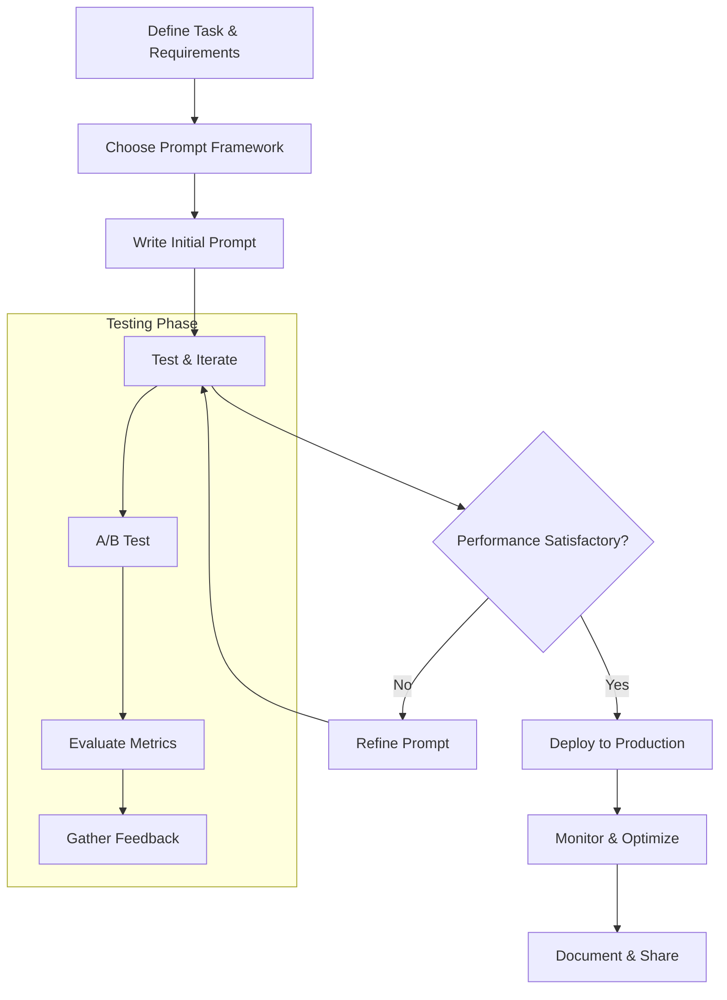
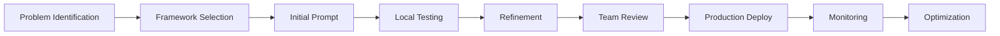
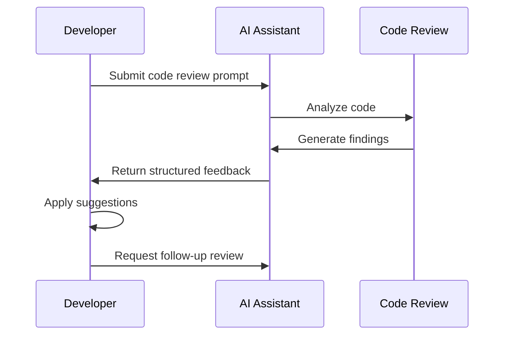

# The Complete Guide to Prompt Engineering for Developers

## Table of Contents
1. [Introduction](#introduction)
2. [Understanding Prompt Engineering](#understanding-prompt-engineering)
3. [Essential Prompt Components](#essential-prompt-components)
4. [Popular Prompt Frameworks](#popular-prompt-frameworks)
5. [Code-Specific Prompting Techniques](#code-specific-prompting-techniques)
6. [AI Task Prompting Strategies](#ai-task-prompting-strategies)
7. [Testing and Evaluation](#testing-and-evaluation)
8. [Best Practices](#best-practices)
9. [Common Pitfalls](#common-pitfalls)
10. [Tools and Resources](#tools-and-resources)
11. [Workflow Examples](#workflow-examples)

## Introduction

Prompt engineering is the art and science of crafting effective instructions for AI models to achieve desired outcomes. For developers, this skill is crucial for leveraging AI tools effectively in coding, debugging, documentation, and system design tasks.

## Understanding Prompt Engineering

### What is Prompt Engineering?

Prompt engineering involves designing and optimizing input prompts to guide AI systems toward generating accurate, relevant, and useful outputs. It's essentially programming with natural language.

### Why It Matters for Developers

- **Efficiency**: Well-crafted prompts reduce iteration time
- **Accuracy**: Specific prompts generate more relevant code and solutions
- **Consistency**: Structured prompts ensure reproducible results
- **Productivity**: Effective prompts accelerate development workflows

## Essential Prompt Components

### Core Elements

1. **Clear Instructions**: Specific, actionable directions
2. **Context**: Background information and constraints
3. **Examples**: Demonstrations of desired output
4. **Format Specifications**: Structure and style requirements
5. **Role Definition**: Establishing AI's perspective and expertise

### Prompt Structure Template

```
[ROLE] You are a [specific role/expertise level]

[CONTEXT] Working on [project/situation details]

[TASK] I need you to [specific action]

[REQUIREMENTS]
- Requirement 1
- Requirement 2
- Requirement 3

[FORMAT] Please format your response as:
- Section 1: [description]
- Section 2: [description]

[EXAMPLE] Here's an example of what I'm looking for:
[example content]
```

## Popular Prompt Frameworks

### 1. APE (Action, Purpose, Expectation)
**Best for**: Simple, clear task definition
**Structure**:
- **Action**: What needs to be done
- **Purpose**: Why it's needed
- **Expectation**: What the output should look like

**Example**:
```
Action: Review this Python function for bugs
Purpose: To ensure code quality before deployment
Expectation: List of issues with explanations and suggested fixes
```

### 2. RACE (Role, Action, Context, Expectation)
**Best for**: Role-specific expertise tasks
**Structure**:
- **Role**: Define the AI's expertise
- **Action**: Specific task to perform
- **Context**: Background information
- **Expectation**: Desired outcome

**Example**:
```
Role: You are a senior DevOps engineer
Action: Design a CI/CD pipeline
Context: For a Node.js microservices application on AWS
Expectation: YAML configuration with deployment stages
```

### 3. COAST (Context, Objective, Actions, Scenarios, Task)
**Best for**: Complex scenario planning
**Structure**:
- **Context**: Current situation
- **Objective**: End goal
- **Actions**: Possible steps
- **Scenarios**: Different conditions
- **Task**: Specific request

### 4. Chain of Thought (CoT)
**Best for**: Complex reasoning and problem-solving
**Structure**: Add "Let's think step by step" to encourage logical reasoning

**Example**:
```
Debug this JavaScript error: "Cannot read property 'length' of undefined"
Let's think step by step:
1. First, identify where the error occurs
2. Then, check what variable is undefined
3. Finally, provide a solution with error handling
```

## Code-Specific Prompting Techniques

### 1. Code Review Prompts

**Template**:
```
You are an experienced [language] developer. Review the following code for:
- Logic errors
- Performance issues
- Security vulnerabilities
- Code style and best practices

[CODE HERE]

Provide:
1. Issues found (with line numbers)
2. Severity rating (Low/Medium/High)
3. Specific recommendations
4. Improved code if applicable
```

### 2. Debugging Prompts

**Template**:
```
I'm encountering the following error in my [language] code:
Error: [error message]

Code:
[CODE HERE]

Context:
- [Runtime environment]
- [Input data]
- [Expected behavior]

Please:
1. Explain the root cause
2. Provide step-by-step debugging approach
3. Show the corrected code
4. Suggest prevention strategies
```

### 3. Code Generation Prompts

**Template**:
```
Create a [language] [function/class/module] that:

Requirements:
- [Specific requirement 1]
- [Specific requirement 2]
- [Performance considerations]

Constraints:
- [Technology limitations]
- [Style guidelines]

Include:
- Comprehensive docstrings
- Type hints
- Error handling
- Unit tests
```

### 4. Documentation Prompts

**Template**:
```
Generate comprehensive documentation for this [language] [function/class/API]:

[CODE HERE]

Include:
- Clear description
- Parameters and return types
- Usage examples
- Error conditions
- Best practices

Format: [Markdown/JSDoc/Sphinx/etc.]
```

## AI Task Prompting Strategies

### 1. Data Analysis Prompts

**Template**:
```
You are a data analyst. Analyze the following dataset and provide:

Data: [data description/sample]

Analysis needed:
- [Specific analysis type]
- [Metrics to calculate]
- [Insights to uncover]

Output format:
- Summary statistics
- Key findings
- Visualizations needed
- Recommendations
```

### 2. Architecture Design Prompts

**Template**:
```
You are a software architect. Design a system architecture for:

Requirements:
- [Functional requirements]
- [Non-functional requirements]
- [Constraints]

Technology stack: [preferred technologies]

Provide:
1. High-level architecture diagram description
2. Component breakdown
3. Data flow explanation
4. Scalability considerations
5. Security measures
```

### 3. Algorithm Development Prompts

**Template**:
```
Design an algorithm that [specific goal]:

Input: [input description]
Output: [expected output]
Constraints: [time/space complexity, limitations]

Requirements:
- [Specific requirement 1]
- [Specific requirement 2]

Please provide:
1. Algorithm description
2. Pseudocode
3. Implementation in [language]
4. Time/space complexity analysis
5. Test cases
```

## Testing and Evaluation

### A/B Testing Prompts

Test different prompt variations to find the most effective approach:

**Version A (Simple)**:
```
Write a function to sort an array.
```

**Version B (Detailed)**:
```
Create a Python function that sorts an array of integers using merge sort algorithm.
Include error handling, docstrings, and time complexity analysis.
```

### Evaluation Metrics

1. **Relevance**: How well does the output match the request?
2. **Accuracy**: Is the generated code/solution correct?
3. **Completeness**: Does it address all requirements?
4. **Clarity**: Is the output well-structured and understandable?
5. **Consistency**: Do similar prompts produce similar quality results?

### Testing Framework

```python
def evaluate_prompt(prompt, expected_criteria):
    """
    Evaluate prompt effectiveness
    """
    scores = {
        'relevance': 0,
        'accuracy': 0,
        'completeness': 0,
        'clarity': 0,
        'consistency': 0
    }
    
    # Generate response
    response = generate_ai_response(prompt)
    
    # Score each criterion (1-10)
    for criterion in expected_criteria:
        scores[criterion] = rate_response(response, criterion)
    
    return scores, response
```

## Best Practices

### 1. Be Specific and Clear

**❌ Bad**:
```
Make this code better.
```

**✅ Good**:
```
Refactor this Python function to improve readability and performance.
Focus on variable naming, reducing complexity, and optimizing the algorithm.
```

### 2. Provide Context

**❌ Bad**:
```
Write a database query.
```

**✅ Good**:
```
Write a PostgreSQL query to find all users who:
- Registered in the last 30 days
- Have made at least 2 purchases
- Are from the US or Canada

Tables: users (id, name, email, country, created_at), orders (id, user_id, created_at)
```

### 3. Use Examples

**❌ Bad**:
```
Format the output nicely.
```

**✅ Good**:
```
Format the output as a JSON object like this:
{
  "status": "success",
  "data": {...},
  "message": "Operation completed"
}
```

### 4. Iterate and Refine

Start with a basic prompt and gradually add details:

**Iteration 1**:
```
Explain this error.
```

**Iteration 2**:
```
Explain this JavaScript error and how to fix it.
```

**Iteration 3**:
```
Explain this JavaScript error, why it occurs, and provide a complete solution with prevention strategies.
```

### 5. Use Delimiters

Separate different parts of your prompt clearly:

```
### Task ###
Generate a REST API endpoint

### Requirements ###
- POST /api/users
- Accept JSON payload
- Validate required fields

### Output Format ###
- Express.js code
- Error handling
- Input validation
```

## Common Pitfalls

### 1. Vague Instructions

**Problem**: "Make it work"
**Solution**: Specify exactly what "work" means

### 2. Too Many Tasks at Once

**Problem**: Asking for code generation, testing, documentation, and deployment in one prompt
**Solution**: Break into separate, focused prompts

### 3. Assuming Context

**Problem**: Not explaining the development environment or constraints
**Solution**: Always provide relevant context

### 4. Ignoring Format Requirements

**Problem**: Not specifying output format
**Solution**: Always define expected output structure

### 5. No Examples

**Problem**: Abstract requirements without concrete examples
**Solution**: Include specific examples of desired output

## Tools and Resources

### Prompt Management Tools

1. **PromptLayer**: Version control and A/B testing for prompts
2. **Langfuse**: Prompt management and evaluation
3. **Writer**: Team prompt collaboration
4. **Latitude**: Prompt versioning and optimization

### Testing Frameworks

1. **OpenAI Evals**: Evaluation framework for AI models
2. **FLEX**: Few-shot NLP evaluation
3. **Mirascope**: Python toolkit for LLM applications

### Documentation Tools

1. **Notion**: Prompt libraries and documentation
2. **GitHub**: Version control for prompt templates
3. **Confluence**: Team knowledge sharing

## Workflow Examples

### Mermaid Workflow Diagram



### Development Workflow



### Code Review Workflow



## Conclusion

Effective prompt engineering is a crucial skill for developers working with AI tools. By following these frameworks, best practices, and testing strategies, you can significantly improve your productivity and code quality.

Remember:
- Start simple and iterate
- Be specific and provide context
- Test different approaches
- Document what works
- Share knowledge with your team

The key to mastering prompt engineering is practice and continuous refinement. Start with the basic frameworks and gradually develop your own style and templates for common tasks.

## Quick Reference

### Prompt Checklist
- [ ] Clear role definition
- [ ] Specific task description
- [ ] Relevant context provided
- [ ] Expected output format defined
- [ ] Examples included (if applicable)
- [ ] Constraints specified
- [ ] Success criteria defined

### Common Templates

**Bug Fix Template**:
```
Error: [specific error message]
Code: [relevant code snippet]
Context: [environment, inputs, expected behavior]
Request: [step-by-step solution with explanation]
```

**Code Generation Template**:
```
Task: Create [specific component]
Requirements: [numbered list]
Constraints: [limitations]
Output: [format requirements]
```

**Documentation Template**:
```
Document: [code/API/system]
Audience: [target users]
Format: [specific format]
Include: [required sections]
```

This guide provides a comprehensive foundation for effective prompt engineering in software development. Practice these techniques and adapt them to your specific needs and context.